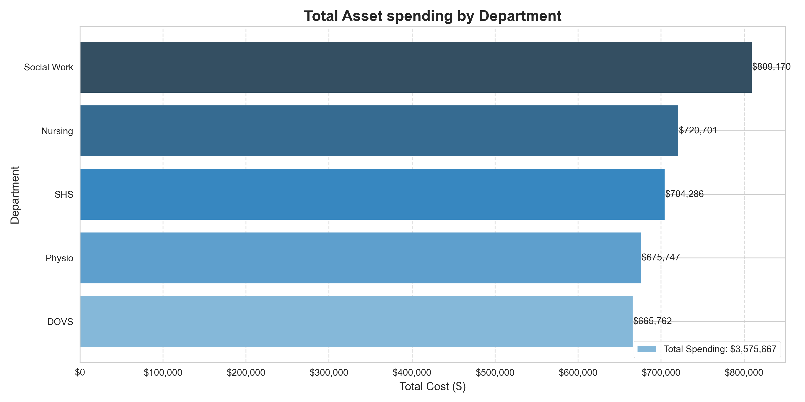
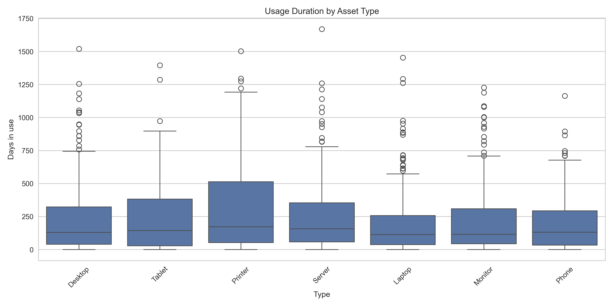
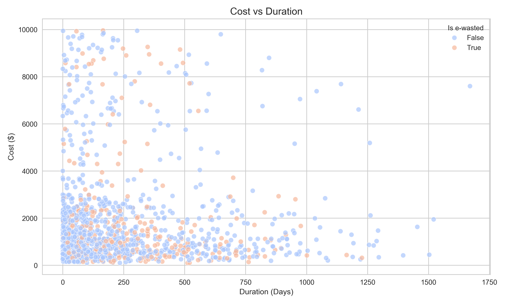

# IT Asset Inventory: Exploratory Data Analysis

## Project Overview

The aim of this project is to investigate a simulated IT asset inventory data from an organisation. The fields reflect a realistic IT inventory attributes at an organisation starting from 2020. To avoid security risks, the records present in the dataset are fictional and were generated using an LLM. Additionally, the LLM was not provided with any sensitive information for the dataset generation. 

The goal of the analysis is to uncover patterns in asset costs (particularly based on departments and types of asset), usage duration, and e-waste, and provide actionable insights for improving the asset management strategies. 

The IT asset management system is based on the following procedure:
- Procurement staff member requests IT department to source an asset with specified details including the assigned staff member details.
- The asset request is approved and an asset sticker (with a unique identifier) is assigned to the asset after it is sourced.
- The asset is then delivered to the department and/or assigned staff member.
- When an asset fails or finished its lifecycle, it can be requested to be e-wasted (retired).

## Dataset Overview

- **Records**: 2,000 assets
- **Key Columns**:
  - Asset Type
  - Date Ordered
  - Date Assigned
  - Date Returned
  - Department
  - Cost
  - e-Wasted
- Simulated dataset reflecting realistic IT inventory attributes at an organisation.

## Tech Stack
- **Language**: Python  
- **Libraries**: pandas, seaborn, matplotlib  
- **Tools**: Jupyter Notebook

## Data Cleaning Highlights
- Removed duplicates asset entries to ensure data integrity.
- Removed columns not relevant to the analysis.
- Parsed and corrected inconsistent date formats.
- Derived columns for analysis and visualisation.
- Performed standardization for string columns by removing whitespaces and standardizing the text.
- Performed validity checks, such as ensuring that the date assigned and date returned are logical for all records.

## Key Insights
- **Right-skewed asset cost distribution**, with most assets under `$2500` and a few reaching `$10,000`.
- `Social Work` has the highest overall asset spend and with `DOVS` being the lowest (Difference of almost `$145,000`).
- `Laptops`, `Monitors` and `Tablets` were the most frequently e-wasted and had shorter lifecycle durations, with `Printers` and `Servers` having the longest average lifecycle. `Printers` also displayed the widest usage range indicating some units remain in service significantly longer than others.
- E-waste rates greatly increased by `2023` but observed a dramatic decline after mid of `2023`.
- There is a strong correlation between the cost of the asset and the lifespan, indicating that cheaper assets tend to have shorter lifecycles. Additionally, a significant number of assets are high cost while having short lifespans.

## Visual Highlights

- Department level cost bar chart breaking down the total spending across each department over the 5 year period.

- Boxplot showing the distribution of how long different asset types were in use before being marked as e-waste.

- Scatterplot showing the distribution of assets based on their lifespan and cost to determine any correlation between the two categories.

## Key Recommendations
- **Procurement optimization**: Reassess procurement strategy for high-cost, short-duration assets as a significant number of the assets are high cost and shorter in lifecycle. It is imperative to determine the factors can be contributing as the cost for these assets do not reflect their expected lifecycle. A recommendation for conducting a review on these assets, such as their usage, maintenence procedures, and manufacturer will aid in determining a strategy to mitigate the expenses.
- **Departmental management assessment**: Evaluate the high asset expenses in certain departments such as `Social Work`, and cross analyze with a review of efficient departments, such as `DOVS`, to determine any potential strategies that can be implemented to other departments to cut down on costs and e-waste.
- **Effective e-waste strategy**: The current e-waste management strategy appears to be effective as the number of e-waste appears to be reducing rapidly since the mid of `2023`, likely as a response due to the high e-waste usage prior to that period. The number of e-wasted assets is approaching the levels of late `2020` (which displayed the lowest rates in the recorded period). The recommendation is to maintain this strategy for the future while monitoring for any changes.
- **Frequent end-user asset wastage**: `Laptops`, `Monitors` and `Tablets` have the highest e-waste rates compared to shared-office assets such as `Printers` or infrastructure assets such as `Servers`. This indicates that these devices typically have a regular upgrade cycle. The count of each type of assets are similar, so the large discrepancy in lifespans most likely has another factor contributing to the high e-waste rates that need further investigation. If the current process leads to early retirement of assets due to various factors, it is worth addressing by utilizing means such as **tracking the device health** through performance monitoring tools to determine if the devices are being decommissioned prematurely. This will reduce e-waste rates and overall expenses.
